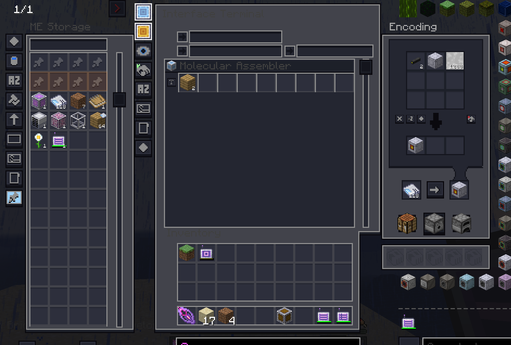

# GTNH QoL Improvements

面向 GT New Horizons 1.7.10 Daily 的轻量 QoL 模组，集中改善金刚杵操作与 AE2 样板编码流程。所有功能均可在配置页中独立开关。

## 主要功能

### 快速编码终端

- 在同一界面中整合 ME 库存、接口终端和样板编码。
- 支持 3×3 合成、3×3 处理和 4×4 处理样板，并自动适配配方类型。
- 支持 NEI 配方转移、Alt 一键编码/搜索/上传，以及 GT 虚拟电路和不消耗物品的搜索后缀。
- 可放入 Baubles Expanded 的 `Terminal` 饰品槽，并通过自定义快捷键打开。
- 可与 AE2FC 能量卡或量子桥卡合成，获得无限电力或无视距离与维度限制的能力。

终端的合成材料为 ME 无线终端、ME 扩展样板终端和 ME 接口终端。

### 金刚杵增强

- 挖掘时自动使用副手方块替换原方块。
- 提供 GT 扳手与剪线钳的九宫格交互，可调整机器朝向以及线缆、管道连接。
- 加入手感同创造模式的长按挖掘保护，点按不受影响，降低误拆机器和管线的风险。

## 配置

在 `Mods -> GTNH QoL Improvements -> Config` 中设置，配置文件为 `config/gtnh_qol_improvements.cfg`。

四个独立开关：

- `vajraOffhandReplacement`
- `vajraToolFunctions`
- `dualTerminal`
- `terminalGtRecipeSearchSuffix`

## 依赖

适用于包含 AE2、AE2 Fluid Crafting、GregTech 5U、NEI、Backhand 和 Baubles Expanded 的 GTNH Daily 实例。模组需要同时安装在客户端和服务端。

仓库同时提供 [Modernity Dark UI 适配资源包](resourcepack/modernity-dark-ui)，在资源包列表中将其置于 Modernity 之上即可使用；每次 tag 发布都会自动附带对应 ZIP。

## 致谢

快速编码终端的创意来源于 [AE2Things](https://github.com/asdflj/AE2Things)，感谢其作者和贡献者为 GTNH 社区提供的优秀设计。

## 许可证

本项目采用 [GNU General Public License v3.0](LICENSE) 许可证。
